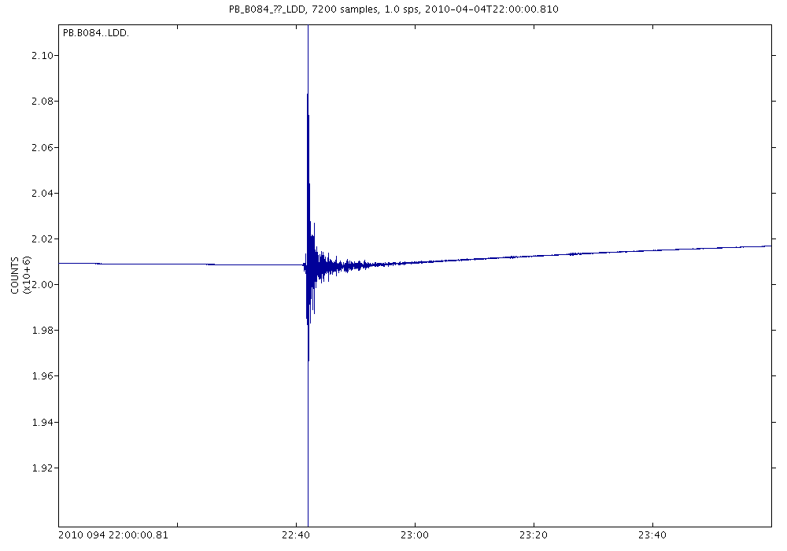

#_*irisws*_

Access to the
Incorporated Research Institutions in Seismology
(IRIS) Web Services (WS) from within R

------

This project is intended to serve as a tool
to access
[Incorporated Research Institutions in Seismology (IRIS) Web Services (WS)](http://service.iris.edu/) 
using the R programming language.
The repository is a self-consistent R-package, meaning
one can do the following:

~~~~~{.R}
install.packages("devtools", dependencies=TRUE)
library(devtools)
install_github("abarbour/irisws", dependencies=TRUE)
~~~~~

and from then on

~~~~~{.R}
library(irisws)
# inspect documentation
?irisws
# list current webservice functions:
webservices()  
# and so on...
~~~~~

The latter command prints a list of 
the webservice access-functions
currently included. 

This project has limited functionality, and is evolving from
a rather slowly, so you should re-install often.
Note that you will also need to do the following
for all features in the package to function properly:

~~~~~{.R}
pkgs <- c("lubridate","png","RCurl","reshape2","XML","XML2R")
install.packages(pkgs, dependencies=TRUE)
~~~~~

but these should've been installed at
the `install_github` stage.

Once this code is of suitable
completeness (and reasonably well tested), 
I plan to upload it to [CRAN](http://cran.r-project.org/).
Feel free to contact me 
(<a href="https://github.com/abarbour" class="user-mention">@abarbour</a>)
should you have questions, or wish to contribute; or, use github as it was
intended and commit some changes of your own! :)

------

Examples
------

### Timeseries

Continuous seismic data is easily accessed with the timeseries webservice.
For example, to download an image of two hours of 1-Hz pore pressure data
at PBO station B084, containing signals
from the 
[2010 M7.2 El Mayor Cucapah earthquake](http://en.wikipedia.org/wiki/2010_Baja_California_earthquake):

~~~~~{.R}
require(irisws)

# download the data plotted in a png file
# (the figure itself is generated within the IRIS-WS internal framework)

w <- ws.timeseries(network="PB",    # network code
	station="B084",                 # station code
	location="--",                  # location code
	channel="LDD",                  # channel code
	starttime="2010.094T22:00:00",  # the beginning of the data
	duration=7200,                  # how many second from 'starttime' to download
	output="plot",                  # output format
	filename="myplot.png")          # the filename of the output
~~~~~

which yields the following image:

<!---
# upon success, the data is loaded (an optional feature, but TRUE by default)
# (can plot "nativeRaster" objects only in R > 2.11)
if (exists("rasterImage")) {
   plot(1:2, type='n')
   rasterImage(querydata(w), 1.2, 1.27, 1.8, 1.73, interpolate=FALSE)
}

The result of the original query:
-->

The contents of the object `w`, in this example, include additional
information besides the data returned from IRIS-WS:

~~~~~{.R}
str(w, nchar.max = 70)
#List of 5
# $ file     : chr "myplot.png"
# $ query    : chr "http://service.iris.edu/irisws/timeseries/1/query?net=PB&sta=B084&loc"| __truncated__
# $ success  : logi TRUE
# $ opts     : list()
# $ querydata: 'nativeRaster' int [1:700, 1:1000] -1 -1 -1 -1 -1 -1 -1 -1 -1 -1 ...
#  ..- attr(*, "channels")= int 4
~~~~~

The data returned -- in this case a raster object -- can be accessed
with the `querydata` method:

~~~~~{.R}
qd <- querydata(w)
str(qd)
# 'nativeRaster' int [1:700, 1:1000] -1 -1 -1 -1 -1 -1 -1 -1 -1 -1 ...
# - attr(*, "channels")= int 4
~~~~~

In this example we showed the `plot` query output, but
there are in fact a number of (more useful)
formats which can be obtained -- see 
the documentation ( `?ws.timeseries` ).

### Basic support for Seismic Analysis Code (SAC) files

In regards to obtaining data in a different output format, the package 
includes a limited support framework for working with
[Seismic Analysis Code (SAC)](http://www.iris.edu/files/sac-manual/manual/file_format.html) files 
directly -- these are commonly
used in seismological applications, and are usually
named with the suffix `.sac`.

To illustrate some of the functionality, 
the package includes a `.sac` (binary) file to play with,
which can be read-in and plotted, for example:

~~~~~{.R}
require(irisws)

sacfi <- system.file("sac/elmayorB084_LDD.sac", package="irisws")

# this is a little-endian binary file, so
# be sure to specify (your system may be "big"!)
x <- read.sac(sacfi, is.binary=TRUE, endianness="little")

# the function 'read.sac' returns an object of class 'saclist', for which
# there is a plot method:
plot(x)
~~~~~

The `plot` method yields a figure similar to the one shown above.

### Query parameters from .wadl files

Because I have difficulty keeping track of the the various parameters
required for a given webservice (not to mention the myriad optional
arguments), the package includes a mechanism 
to quickly inspect for parameters via the associated 
[`.wadl`](http://en.wikipedia.org/wiki/Web_Application_Description_Language) 
description;
this eliminates the need to check the service's webpage,
unless details of the different options are needed.

~~~~~{.R}
require(irisws)

#  Access the .wadl file for the timeseries application
wd <- waddler("timeseries")

#  find the parameters acceptable in a query...
print(p <- parameters(wd))

#  and ones which are required
print(subset(p, required))
~~~~~
